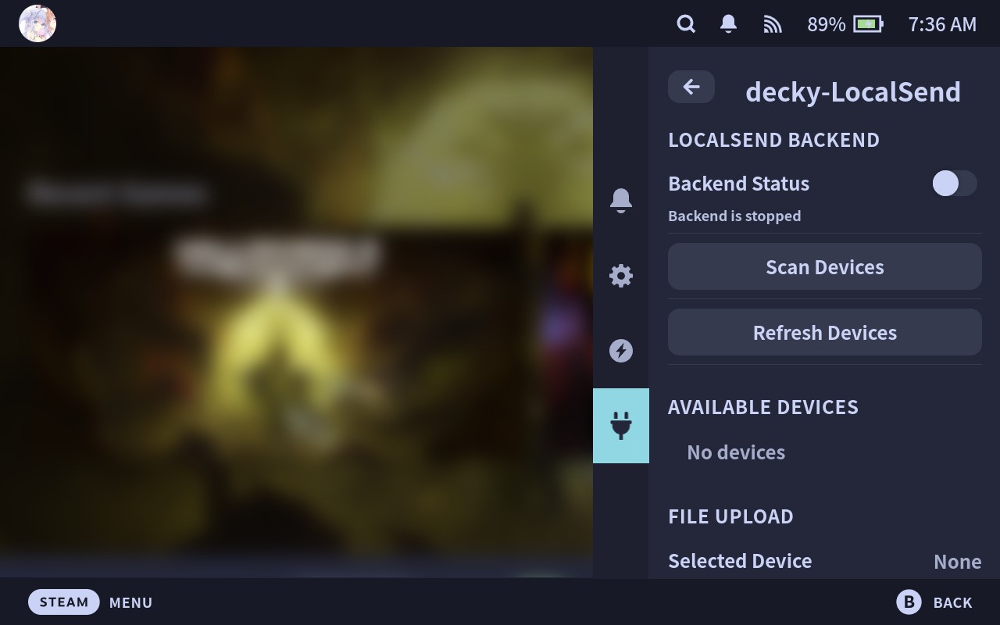

<div align="center">

# decky-localsend

[ENGLISH](README.md) | [简体中文](README-ZH-CN.md)



A Decky Loader plugin that brings LocalSend functionality to Steam Deck gaming mode.

</div>

---

## Overview

This is a Decky Loader plugin that enables LocalSend functionality on Steam Deck in gaming mode. It allows you to easily transfer files, screenshots, and text between your devices and Steam Deck without the hassle of setting up servers or typing IP addresses manually.

The plugin implements the [LocalSend Protocol](https://github.com/localsend/protocol) v2.1, providing seamless cross-platform file sharing.

## Usage

1. Install the plugin on your Steam Deck
2. Open the plugin from the Quick Access menu
3. The LocalSend server will start automatically when clicking start Backend
4. Your Steam Deck will now be discoverable by other LocalSend clients
5. Send files from any device running LocalSend to your Steam Deck

## Configuration

The plugin uses the following default settings:

- **Port:** 53317
- **Protocol:** HTTPS
- **Upload Directory:** `~/homebrew/data/decky-localsend/uploads`
- **Config File:** `~/homebrew/settings/decky-localsend/localsend.yaml`

You can customize these settings through the plugin interface.

## Project Structure

```
.
├── backend/             # Go backend implementation
│   └── localsend/       # LocalSend protocol implementation
├── src/                 # Frontend React components
│   ├── index.tsx        # Main plugin entry
│   └── utils/           # Utility functions
├── main.py              # Python backend bridge
├── plugin.json          # Plugin metadata
└── package.json         # Node.js dependencies
```

## TODO

- [ ] Confortable way of sending files, e.g. choosing screenshot in steam game overview:P
- [ ] Transfer history

## Acknowledgments

- [LocalSend](https://localsend.org)
- [Decky Loader](https://github.com/SteamDeckHomebrew/decky-loader)